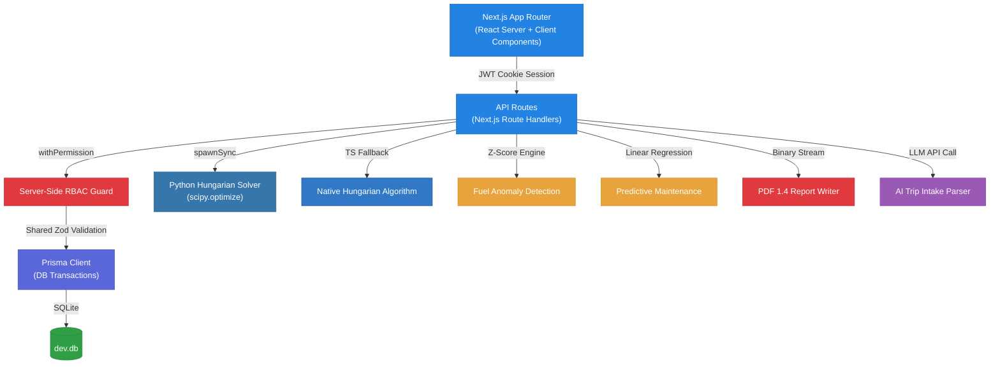

<](https://nextjs.org/)
[](https://www.typescriptlang.org/)
[](https://www.prisma.io/)
[](https://tailwindcss.com/)
[](https://python.org/)
[](https://vitest.dev/)
[](LICENSE)

**IronRoute** is a full-lifecycle industrial fleet operations platform — vehicle management, driver compliance, intelligent trip dispatch, predictive maintenance, fuel analytics, and real-time reporting — purpose-built for the **Odoo 2026 Hackathon Challenge**.

[Live Demo](#-quick-start) · [Features](#-core-features) · [Architecture](#%EF%B8%8F-architecture--system-design) · [Tech Stack](#-technology-stack)

</div>

---

## 📋 Problem Statement

> **Build a comprehensive Transport Management System** that handles vehicle fleet operations, driver management, trip dispatch, maintenance scheduling, fuel/expense tracking, compliance document management, and analytics — going beyond basic CRUD to demonstrate genuine algorithmic depth and production-grade engineering.

IronRoute answers every dimension of this challenge with **four technical differentiators** that elevate it from a standard fleet dashboard into an intelligent operations platform.

---

## ⚡ What Makes IronRoute Different?

Most fleet management solutions rely on basic CRUD grids and simple sorting. IronRoute sets itself apart with **genuine algorithmic depth** and **production-grade engineering**:

<table>
<tr>
<td width="50%">

### 🧮 1. Hungarian Algorithm Batch Optimizer
When ≥2 trips are pending, IronRoute builds a **cost matrix** of every `(trip × eligible vehicle-driver pair)` weighted by:
- **Capacity-fit** — how well the vehicle matches the cargo
- **Driver safety score** — prioritizing safer drivers
- **License-expiry proximity** — avoiding soon-to-expire licenses

It then solves via **`scipy.optimize.linear_sum_assignment`** (Kuhn-Munkres / Hungarian algorithm) for the **fleet-wide optimal assignment** — not a greedy one-at-a-time pick. A native TypeScript fallback ensures resilience if Python is unavailable.

A **visual comparison dashboard** lets dispatchers see optimal vs. naive greedy allocation before confirming.

</td>
<td width="50%">

### 🤖 2. AI-Assisted Trip Intake
Natural language input is parsed via a **server-side LLM call** into structured fields (destination, cargo weight, time window, preferences). The output **pre-fills** the standard trip form for user confirmation — never auto-submitted.

On low-confidence parse or API failure/timeout, it **falls back gracefully** to the manual form with a visible message. Both paths feed through the **identical validation pipeline**, ensuring no business rule is ever bypassed.

</td>
</tr>
<tr>
<td width="50%">

### 📊 3. Z-Score Fuel Anomaly Detection
Rather than simple threshold alerts, IronRoute tracks **trailing refuel logs per vehicle**, computes standard deviation, and flags entries with a high Z-score ($|z| \ge 2.5$).

This surfaces suspicious refuel events with an **in-app explanation badge** showing the exact statistical deviation — labeled transparently as *statistical anomaly detection*, never overpromised as "AI fraud detection."

</td>
<td width="50%">

### 🔧 4. Predictive Maintenance via Linear Regression
IronRoute fits a **least-squares linear regression** ($y = mx + c$) over each vehicle's historical service intervals (date vs. odometer reading). It **forecasts the exact date** when the next service will be required and outputs a **confidence score** based on $R^2$.

For new vehicles with insufficient history, it falls back safely to a **configurable static threshold** — never producing unreliable predictions.

</td>
</tr>
</table>

### 🔒 Bonus: Dependency-Free Binary PDF Generation
To remain resilient on venue networks, IronRoute features a **custom PDF 1.4 byte-stream writer** that produces structured report tables with **zero external dependencies** — no heavy PDF libraries that might fail in serverless edge functions.

---

## ✨ Core Features

### 🔐 Authentication & Role-Based Access Control (RBAC)

| Role | Create Trip | Dispatch | Manage Fleet | Maintenance | Financial Reports | Admin Config |
|:-----|:----------:|:--------:|:------------:|:-----------:|:-----------------:|:------------:|
| **Admin** | ✅ | ✅ | ✅ | ✅ | ✅ | ✅ |
| **Fleet Manager** | ✅ | ✅ | ✅ | ✅ | View only | ❌ |
| **Safety Officer** | ❌ | ❌ | Driver compliance | ❌ | ❌ | ❌ |
| **Financial Analyst** | ❌ | ❌ | ❌ | ❌ | ✅ Full | ❌ |
| **Driver** | ✅ (own) | ❌ | View own | ❌ | ❌ | ❌ |

- **JWT cookie-based sessions** with secure httpOnly tokens
- **Server-side RBAC middleware** (`withPermission`) enforced on **every API endpoint** — not just hidden in the UI
- **bcrypt password hashing** with forgot-password flow
- **Role-filtered sidebar** — each role sees only what they're authorized to access

---

### 📊 Dynamic KPI Dashboard

- **Real-time metrics**: Available Vehicles, Active Vehicles, Vehicles in Maintenance, Active Trips, Pending Trips, Drivers On Duty, Fleet Utilization %
- **Role-based default views**: Financial Analyst sees cost/ROI widgets first; Safety Officer sees license-expiry and safety-score widgets
- **Interactive charts**: Utilization trend (line), Operational cost index (bar), powered by **Recharts**
- **F-pattern layout**: Most important KPIs positioned top-left per UX best practices
- **7-widget cap**: Additional metrics behind drill-down, never crammed onto one screen

---

### 🚛 Vehicle Registry & Document Management

- Full **CRUD** with search, filter, and sort by registration number, type, status, and region
- **Vehicle types**: Truck, Van, Trailer — with max load capacity enforcement
- **Status lifecycle**: `Available` → `On Trip` → `In Shop` → `Retired`
- **Document tracking**: Insurance, registration, and permit files with **expiry date badges**
- **Unique registration number** enforcement with specific inline error messages

---

### 👤 Driver Management & Compliance

- Full **CRUD** with license category, expiry tracking, and contact information
- **Safety scoring** system with automatic status management
- **Status lifecycle**: `Available` → `On Trip` → `Off Duty` → `Suspended`
- **Automatic suspension** for expired licenses — blocked from dispatch at the database transaction level
- **Compliance document** validation and expiry alerting

---

### 🗺️ Trip Management & Dispatch

- **Full lifecycle**: `Draft` → `Dispatched` → `Completed` → `Cancelled`
- **Eligibility filtering**: Only available vehicles/drivers shown in selection
- **Business rule enforcement** via shared validation pipeline:
  - Cargo weight ≤ vehicle max capacity
  - No dispatching retired/in-shop vehicles
  - No assigning suspended or license-expired drivers
  - No double-booking vehicles or drivers already on trip
- **AI-assisted intake** + **batch optimizer** (see differentiators above)

---

### 🔄 Automated Status Cascades (Transactional)

All status transitions execute within **database transactions** to prevent race conditions:

| Action | Vehicle Status | Driver Status |
|:-------|:--------------|:-------------|
| **Dispatch trip** | → `ON_TRIP` | → `ON_TRIP` |
| **Complete trip** | → `AVAILABLE` | → `AVAILABLE` |
| **Cancel trip** | → `AVAILABLE` | → `AVAILABLE` |
| **Open maintenance** | → `IN_SHOP` (removed from dispatch pool) | — |
| **Close maintenance** | → `AVAILABLE` (unless `RETIRED`) | — |

---

### 🔧 Maintenance Management

- Create, track, and close maintenance records
- **Automatic status cascade**: Creating a record sets vehicle to `IN_SHOP`; closing reverts to `AVAILABLE`
- **Predictive maintenance badges** showing forecasted next-service date with confidence score
- Configurable static fallback threshold for new vehicles

---

### ⛽ Fuel & Expense Tracking

- Fuel logs (liters, cost, date) and general expenses per vehicle
- **Auto-computed total operational cost** per vehicle
- **Z-score anomaly detection** with in-app explanation badges
- Flagged entries surface for review with exact statistical deviation data

---

### 📈 Reports & Analytics

- **Fuel Efficiency Report** — consumption trends per vehicle
- **Fleet Utilization Report** — usage rates and idle time
- **Operational Cost Report** — total cost breakdowns
- **Vehicle ROI** — `(Revenue − (Maintenance + Fuel)) / Acquisition Cost`
- **CSV Export** — one-click data export for all reports
- **PDF Export** — custom binary PDF 1.4 writer, zero external dependencies

---

### 🔔 Notifications

- **In-app notification center** with read/unread management
- Alerts for: license expiring within N days, document expiry approaching, predictive maintenance window, new compliance events
- **Notification bell** in the top bar with unread count badge

---

### 🎨 Design & UX

- **Notion-inspired design system** — warm-minimal, high-legibility, calm and information-dense
- **Dark mode** — WCAG 2.2 AA compliant (4.5:1 contrast minimum), not naive color inversion
- **Command palette** (`Cmd/Ctrl+K`) — keyboard-first navigation via `cmdk`
- **Responsive design** — works on 375px, 768px, and 1280px viewports
- **Empty states** — every list/table has a designed empty state with icon + CTA
- **Toast notifications** — bottom-right, auto-dismiss, semantic color accents
- **Micro-interactions** — status transitions visually confirm actions happened
- **Tabular numerics** — all KPI numbers and tables use `font-variant-numeric: tabular-nums`

---

### 📝 Audit Logging

Every status-changing action writes an **AuditLog** entry recording:
- **Actor** — who performed the action
- **Action** — what was done
- **Before/After state** — the exact state delta
- **Timestamp** — when it occurred

---

## 🏗️ Architecture & System Design



### Key Architectural Decisions

| Decision | Rationale |
|:---------|:----------|
| **Server-side RBAC on every route** | Security by default — UI filtering is cosmetic only |
| **DB transactions for status cascades** | Prevents race conditions on concurrent dispatch |
| **Shared validation pipeline** | AI intake and manual entry use identical Zod schemas |
| **Python + TS dual optimizer** | SciPy for optimal performance; TS fallback for resilience |
| **Custom PDF writer** | Zero dependency risk on venue/serverless networks |
| **SQLite for development** | Zero-config local setup; Prisma abstracts for Postgres in production |

---

## 📂 Project Structure

```
ironroute/
├── app/
│   ├── (auth)/              # Login, forgot-password
│   ├── dashboard/           # Role-based KPI dashboard
│   ├── vehicles/            # Vehicle registry CRUD
│   ├── drivers/             # Driver management CRUD
│   ├── trips/               # Trip lifecycle + AI intake
│   ├── maintenance/         # Maintenance records
│   ├── fuel-expenses/       # Fuel logs & expense tracking
│   ├── documents/           # Compliance document management
│   ├── reports/             # Analytics & export hub
│   ├── notifications/       # In-app notification center
│   ├── settings/            # Profile, role matrix, advanced config, sign out
│   └── api/                 # 30+ API route handlers
│       ├── auth/            # Login, logout, forgot-password, me
│       ├── vehicles/        # Vehicle CRUD endpoints
│       ├── drivers/         # Driver CRUD endpoints
│       ├── trips/           # Trip CRUD + dispatch/complete/cancel + intake + optimize
│       ├── maintenance/     # Maintenance CRUD + close
│       ├── fuel-expenses/   # Fuel/expense CRUD
│       ├── documents/       # Document upload/delete
│       ├── notifications/   # List + mark-read
│       └── reports/         # Analytics data + CSV/PDF export
├── components/
│   ├── ui/                  # Design system (button, card, badge, table, modal, toast, ...)
│   ├── layout/              # App shell, sidebar, topbar, command palette, theme toggle
│   ├── dashboard/           # KPI cards, charts
│   ├── vehicles/            # Vehicle forms & cards
│   ├── drivers/             # Driver forms & cards
│   ├── trips/               # Trip forms, AI intake, optimizer comparison
│   ├── maintenance/         # Maintenance forms, predictive badges
│   ├── fuel-expenses/       # Fuel forms, anomaly badges
│   ├── reports/             # Report charts, export buttons
│   ├── notifications/       # Notification list
│   └── settings/            # Role matrix, logout, advanced settings
├── lib/
│   ├── auth/                # Session (JWT), password (bcrypt), RBAC middleware
│   ├── domain/              # Enums, permissions matrix
│   ├── validation/          # Zod schemas for all entities
│   ├── optimizer/           # Hungarian algorithm (TS) + cost matrix builder
│   ├── analytics/           # Fuel anomaly (z-score) + predictive maintenance (regression)
│   ├── reports/             # Custom PDF 1.4 binary writer
│   └── db.ts                # Prisma client singleton
├── prisma/
│   ├── schema.prisma        # 10 models, 8 enums, full relations
│   └── seed.ts              # Realistic demo data (12 vehicles, 8 drivers, anomalies, expiries)
├── tests/                   # RBAC matrix, lifecycle, validation, anomaly, optimizer tests
├── public/                  # Static assets
└── package.json
```

---

## 🔑 Sandbox Accounts

Quick-login buttons are available on the landing page for rapid evaluation. Manual credentials:

| Role | Email | Password | Access Scope |
|:-----|:------|:---------|:-------------|
| 🔴 **Admin** | `admin@ironroute.local` | `Admin123!` | Full platform access — configurations, dispatches, audits, exports |
| 🟠 **Fleet Manager** | `manager@ironroute.local` | `Manager123!` | Vehicle & driver CRUD, trip drafts, dispatches, maintenance |
| 🟡 **Safety Officer** | `safety@ironroute.local` | `Safety123!` | Driver profiles, compliance documents, safety validations |
| 🟢 **Financial Analyst** | `finance@ironroute.local` | `Finance123!` | Financial rollups, fuel anomaly flags, report exports |
| 🔵 **Driver** | `driver@ironroute.local` | `Driver123!` | Create draft trips, view assigned trips, log odometer/fuel |

---

## 🚀 Quick Start

### Prerequisites
- [Node.js v18+](https://nodejs.org/)
- [Python 3.8+](https://python.org/) with `scipy` and `numpy` *(optional — TS fallback available)*

### 1. Clone & Install

```bash
git clone https://github.com/your-org/ironroute.git
cd ironroute
npm install
```

### 2. Environment Setup

```bash
cp .env.example .env
# Edit .env with your configuration (defaults work for local development)
```

### 3. Database Setup

Initialize the SQLite database and seed it with realistic demo data:

```bash
npx prisma db push
npm run prisma:seed
```

The seed script creates:
- **5 users** (one per role)
- **12 vehicles** (mixed types and statuses, one pre-flagged for maintenance)
- **8 drivers** (mixed statuses, one with near-expiry license)
- **Historical fuel logs** (including seeded anomalies for z-score detection)
- **Documents** (including near-expiry entries for notification testing)

### 4. Start Development Server

```bash
npm run dev
```

Open **[http://localhost:3000](http://localhost:3000)** — you'll see the login page with quick-login role buttons.

### 5. Run Tests

```bash
npm run test
```

Runs the full suite: RBAC permission matrix, transaction lifecycle, validation rules, fuel anomaly detection, and optimizer correctness.

---

## 🎬 Demo Walkthrough (4 minutes)

1. **Dashboard at rest** — seeded data populates KPI cards and charts; one document is flagged as near-expiry
2. **AI-assisted dispatch** — type a natural-language request → AI parses it → user confirms → batch optimizer runs (≥2 pending trips) → compare optimal vs. greedy assignment
3. **Dispatch** — confirm the optimal assignment → live status cascade on dashboard (vehicle + driver → `ON_TRIP`)
4. **Complete trip** — cost/efficiency reports update; a seeded vehicle is flagged as a fuel-efficiency anomaly with z-score explanation
5. **Maintenance** — close a maintenance record whose "predicted due" badge was shown earlier → vehicle reverts to `AVAILABLE`
6. **Export** — generate a PDF report live using the custom binary writer
7. **Dark mode** — toggle the theme to demonstrate WCAG 2.2 AA contrast compliance

---

## 🧪 Technology Stack

| Layer | Technology | Purpose |
|:------|:-----------|:--------|
| **Framework** | Next.js 16.2 (App Router, Turbopack) | Server & client rendering, API routes |
| **Language** | TypeScript 5.x | Type-safe full-stack development |
| **Styling** | Tailwind CSS 4.0 + CSS Variables | Notion-inspired design system |
| **Icons** | Lucide React | Consistent iconography |
| **Database** | Prisma ORM + SQLite | Type-safe queries, zero-config local DB |
| **Auth** | JWT (jose) + bcrypt | Secure session management |
| **Optimizer** | Python (SciPy) + TypeScript fallback | Hungarian algorithm batch dispatch |
| **Charts** | Recharts | Responsive line and bar charts |
| **Command Palette** | cmdk | Keyboard-first navigation |
| **Validation** | Zod | Runtime schema validation |
| **Testing** | Vitest | Unit and integration tests |
| **PDF Export** | Custom binary writer | Dependency-free PDF 1.4 generation |

---

## 📊 Business Rules Enforced

| # | Rule | Enforcement |
|:-:|:-----|:------------|
| 1 | Vehicle registration number must be unique | DB unique constraint + inline error |
| 2 | Retired / In Shop vehicles excluded from dispatch | Query filter + validation |
| 3 | Expired-license / suspended drivers blocked from trips | Server-side validation |
| 4 | On-trip vehicle/driver cannot be double-booked | DB transaction isolation |
| 5 | Cargo weight ≤ vehicle max load capacity | Shared Zod validation pipeline |
| 6 | Dispatch → vehicle + driver become `ON_TRIP` | Transactional status cascade |
| 7 | Complete → vehicle + driver revert to `AVAILABLE` | Transactional status cascade |
| 8 | Cancel → vehicle + driver revert to `AVAILABLE` | Transactional status cascade |
| 9 | Maintenance open/close cascades vehicle status | Transactional status cascade |
| 10 | AI intake uses identical validation pipeline | Shared Zod schemas |
| 11 | Optimizer excludes ineligible pairs entirely | Cost matrix builder |
| 12 | Every status change writes an AuditLog entry | Middleware + transaction hooks |

---

## 🐳 Docker

```bash
docker-compose up --build
```

The container handles database migration, seeding, and starts the production server on port **3000**.

---

## 📄 License

This project was built for the **Odoo 2026 Hackathon**. MIT Licensed.

---

<div align="center">

**Built with ❤️ for the Odoo 2026 Hackathon**

*IronRoute — because fleet management deserves algorithmic depth, not just another CRUD grid.*

</div>
]]>
