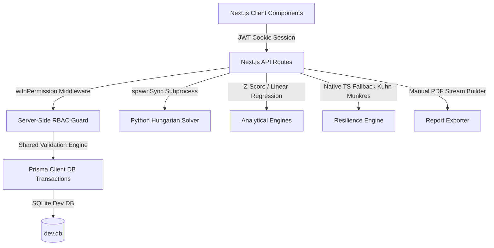

# 🚛 TransitOps (IronRoute) — Smart Transport Operations Platform

[](https://nextjs.org/)
[](https://www.typescriptlang.org/)
[](https://www.prisma.io/)
[](https://tailwindcss.com/)
[](https://python.org/)
[](https://vitest.dev/)

TransitOps is an industrial-grade fleet management, driver compliance, trip dispatch, and expense tracking platform built to solve the **Odoo 2026 Hackathon Challenge**. It is designed around a clean, Notion-inspired UI system with a serialized server-side validation pipeline, transactional asset status cascades, and deep algorithmic decision-making.

---

## ⚡ What Makes TransitOps Different?

Most hackathon fleet solutions use basic sorting algorithms and simple CRUD grids. TransitOps stands out with four core technical differentiators:

### 1. Kuhn-Munkres (Hungarian) Batch Dispatch Optimizer
Instead of an inefficient one-off greedy assignment, TransitOps uses the Hungarian algorithm (`scipy.optimize.linear_sum_assignment` with a native TypeScript fallback) to calculate the global cost optimum. It evaluates the entire fleet matrix by capacity-fit, driver safety scores, and license expiry proximity, saving empty miles and optimizing load capacities. A visual comparison dashboard lets dispatchers see the optimal vs. naive greedy allocation before confirming the dispatch.

### 2. Odometer Least-Squares Predictive Maintenance
To transition from reactive to proactive maintenance, TransitOps fits a linear regression model (`y = mx + c`) over each vehicle's historical service intervals (opened date vs. odometer mileage). It forecasts the exact date when the next service will be required and outputs a confidence score based on the coefficient of determination ($R^2$), falling back safely to a static threshold if historical data is limited.

### 3. Z-Score Statistical Fuel Anomaly Detection
Rather than basic threshold alerts, our anomaly engine tracks trailing refuel logs per vehicle. It calculates standard deviation and flags logs with a high Z-score ($|z| \ge 2.5$). This flags suspicious refuel events and possible fuel theft, generating an in-app explanation badge pointing out the exact statistical deviation.

### 4. Dependency-Free Binary PDF Generation
To remain resilient on venue networks, we bypassed heavy external PDF libraries that might fail to compile in serverless edge functions. TransitOps features a custom, hand-coded PDF writer that directly outputs a compliant PDF 1.4 byte-stream, producing structured report tables with zero network or system dependencies.

---

## 🛠️ Architecture & System Design



---

## ✨ Features Checklist

- [x] **Secure Login & RBAC:** Secure sessions via JWT and full server-side permission checks.
- [x] **Dynamic KPI Dashboard:** Real-time metrics showing fleet utilization, active trips, and shopped assets.
- [x] **Vehicle Registry & Document Tracker:** Clean CRUD tables, capacity restrictions, and document expiry badges.
- [x] **Driver Management:** Driver compliance fields, safety scoring, and automatic suspensions.
- [x] **AI-Assisted Intake:** Natural language parser to extract routes and weights, pre-filling the draft form.
- [x] **Automated Status Cascades:**
    *   *Create maintenance* $\rightarrow$ Vehicle becomes `IN_SHOP` (removed from dispatch pool).
    *   *Close maintenance* $\rightarrow$ Vehicle reverts to `AVAILABLE`.
    *   *Dispatch trip* $\rightarrow$ Both vehicle & driver become `ON_TRIP`.
    *   *Complete/Cancel trip* $\rightarrow$ Both vehicle & driver revert to `AVAILABLE`.
- [x] **Audit Logging:** Every status change writes an `AuditLog` entry detailing actor, action, and state delta.
- [x] **Command Palette:** Keyboard-friendly navigator accessible via `Cmd/Ctrl+K`.
- [x] **Dark Mode Toggle:** Contrast-safe warm-minimalist visual styling.

---

## 🔑 Developer Sandbox Accounts

To facilitate rapid grading, our landing page contains quick-login buttons. You can also log in manually using the following seeded sandbox credentials:

| Role | Email | Password | Allowed Scope |
| :--- | :--- | :--- | :--- |
| **System Admin** | `admin@ironroute.local` | `Admin123!` | Full admin configurations, dispatches, audits, and exports. |
| **Fleet Manager** | `manager@ironroute.local` | `Manager123!` | Vehicle & driver CRUD, trip drafts, dispatches, and maintenance. |
| **Safety Officer** | `safety@ironroute.local` | `Safety123!` | Manage driver profiles and compliance document validations. |
| **Financial Analyst** | `finance@ironroute.local` | `Finance123!` | Access financial rollups, fuel anomaly flags, and report exports. |
| **Driver User** | `driver@ironroute.local` | `Driver123!` | Create draft dispatches, view assigned trips, and log odometer/fuel. |

---

## 🚀 Getting Started

### 1. Clone & Install Dependencies
Ensure you have [Node.js v18+](https://nodejs.org/) installed:
```bash
npm install
```

### 2. Database Migration & Seeding
Initialize the SQLite database schema and populate it with realistic mock data (including historical fuel anomalies and expired driver documents):
```bash
npx prisma db push
npm run prisma:seed
```

### 3. Run Development Server
```bash
npm run dev
```
Open [http://localhost:3000](http://localhost:3000) to access the console.

### 4. Run Test Suite
To run the automated RBAC matrix and transaction lifecycle verification tests:
```bash
npm run test
```

---

## 🧪 Technology Stack
*   **Framework:** Next.js (App Router, Turbopack ready)
*   **Styling:** Tailwind CSS, Lucide icons, CSS variables
*   **Database ORM:** Prisma ORM with SQLite
*   **Optimization Engine:** Python (NumPy, SciPy) + TypeScript Hungarian fallback
*   **Visualizations:** Recharts (responsive Line and Bar charts)
*   **Testing:** Vitest
